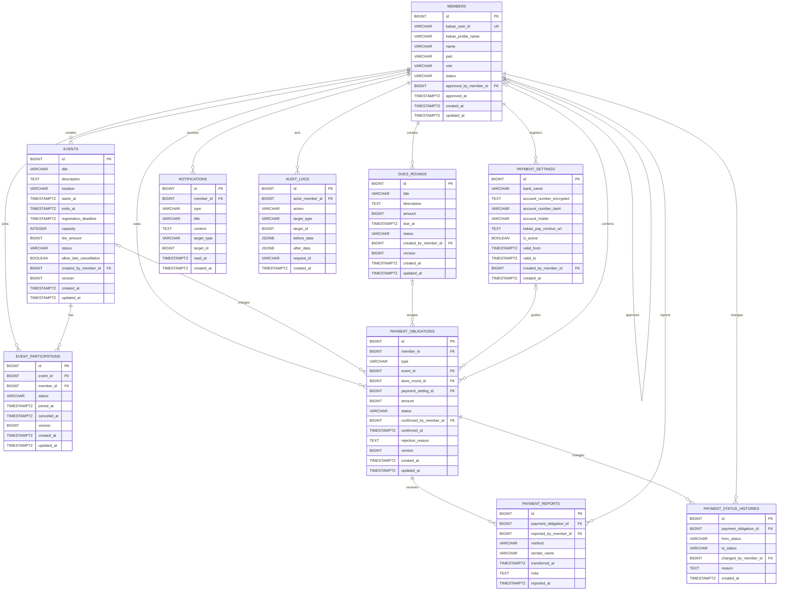
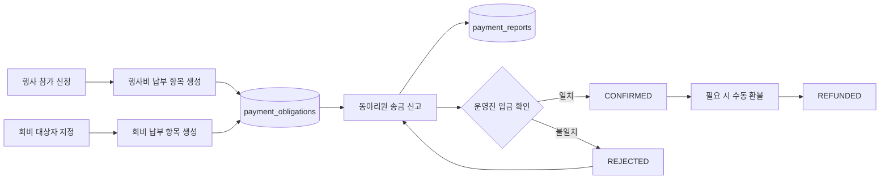
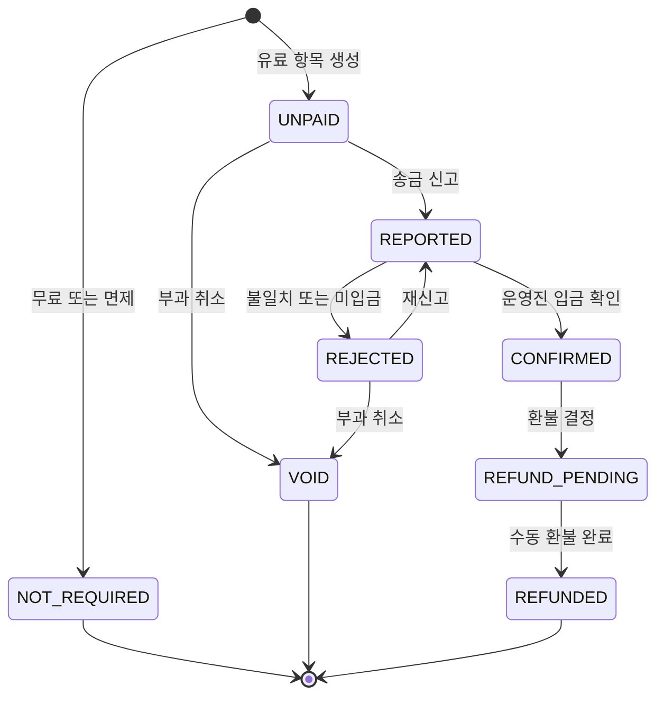

# 교내 개발 동아리 행사·회비 관리 웹앱 ERD 설계서

> 문서 상태: 초안 v0.1  
> 기준 DBMS: PostgreSQL  
> 연관 문서: [서비스 기획서](./product-plan.md)

## 1. 설계 목표

- 회원, 행사, 참가 신청, 정기 회비를 명확한 관계로 관리한다.
- 행사 참가비와 정기 회비를 `payment_obligations`라는 공통 개인별 납부 항목으로 관리한다.
- 동아리원의 `송금했어요` 신고와 운영진의 실제 입금 확인을 별도 데이터로 관리한다.
- 금액, 납부 상태, 송금정보 및 운영진 처리 이력을 보존한다.
- 운영 중 데이터 삭제보다 상태 변경을 우선해 회계 추적 가능성을 확보한다.
- 카카오 프로필 이름이나 최종 닉네임이 아닌 내부 회원 ID로 모든 관계를 연결한다.

## 2. 전체 ERD

아래 Mermaid 다이어그램은 MVP 기준 엔티티와 주요 외래키 관계를 나타낸다.



### 2.1 관계 해석

- 회원 한 명은 여러 행사에 참가할 수 있고, 행사 한 개에는 여러 회원이 참가할 수 있다. 다대다 관계는 `event_participations`로 해소한다.
- 행사 참가 신청이 완료되면 유료 행사에는 회원별 `payment_obligations` 한 건을 생성한다.
- 회비 회차를 열면 대상 회원마다 `payment_obligations` 한 건을 생성한다.
- 납부 항목 한 건에는 송금 재신고를 포함해 여러 `payment_reports`가 연결될 수 있다.
- 납부 상태가 바뀔 때마다 `payment_status_histories`에 변경 전후 상태를 추가한다.
- `payment_settings`는 버전형 데이터로 유지하며, 납부 항목은 생성 당시 송금정보 레코드를 계속 참조한다.
- `notifications`와 `audit_logs`의 `target_type + target_id`는 여러 도메인을 가리키는 논리적 참조다. 실제 외래키 제약은 두지 않고 애플리케이션에서 유효성을 관리한다.

## 3. 핵심 납부 구조



`payment_obligations`는 “누가, 어떤 이유로, 얼마를 납부해야 하는가”를 나타낸다. `payment_reports`는 “사용자가 언제 어떤 이름과 수단으로 송금했다고 신고했는가”를 나타낸다. 두 데이터를 분리해야 신고와 실제 입금 확인을 혼동하지 않는다.

## 4. 테이블 상세 설계

### 4.1 `members`

카카오 로그인을 통해 생성된 동아리원 계정이다.

| 컬럼 | PostgreSQL 타입 | Null | 제약/기본값 | 설명 |
|---|---|---:|---|---|
| `id` | `BIGINT` | N | PK, Identity | 내부 회원 ID |
| `kakao_user_id` | `VARCHAR(100)` | N | UNIQUE | 카카오 사용자 고유 ID |
| `kakao_profile_name` | `VARCHAR(100)` | Y |  | 마지막으로 받은 카카오 프로필 닉네임 |
| `name` | `VARCHAR(50)` | Y |  | 사용자가 확정한 이름, 온보딩 전에는 `null` 가능 |
| `part` | `VARCHAR(20)` | Y | CHECK | 파트, 온보딩 전에는 `null` 가능 |
| `role` | `VARCHAR(20)` | N | `MEMBER` | 권한 역할 |
| `status` | `VARCHAR(20)` | N | `PENDING` | 회원 상태 |
| `approved_by_member_id` | `BIGINT` | Y | FK → `members.id` | 승인 운영진 |
| `approved_at` | `TIMESTAMPTZ` | Y |  | 승인 시각 |
| `created_at` | `TIMESTAMPTZ` | N | `now()` | 생성 시각 |
| `updated_at` | `TIMESTAMPTZ` | N | `now()` | 수정 시각 |

최종 닉네임은 별도 컬럼으로 중복 저장하지 않고 `{part 표시명} {name}`으로 계산한다. 파트명 표기가 바뀌어도 회원 데이터를 일괄 수정하지 않아도 된다.

### 4.2 `events`

운영진이 작성한 행사 정보다.

| 컬럼 | PostgreSQL 타입 | Null | 제약/기본값 | 설명 |
|---|---|---:|---|---|
| `id` | `BIGINT` | N | PK, Identity | 행사 ID |
| `title` | `VARCHAR(150)` | N |  | 행사명 |
| `description` | `TEXT` | N |  | 행사 내용 |
| `location` | `VARCHAR(200)` | Y |  | 장소 |
| `starts_at` | `TIMESTAMPTZ` | N |  | 시작 시각 |
| `ends_at` | `TIMESTAMPTZ` | Y |  | 종료 시각 |
| `registration_deadline` | `TIMESTAMPTZ` | N |  | 신청 마감 시각 |
| `capacity` | `INTEGER` | Y | CHECK `capacity > 0` | 정원, 제한 없으면 `null` |
| `fee_amount` | `BIGINT` | N | CHECK `fee_amount >= 0` | 참가비, 원 단위 |
| `status` | `VARCHAR(20)` | N | `DRAFT` | 행사 상태 |
| `allow_late_cancellation` | `BOOLEAN` | N | `false` | 마감 후 취소 허용 여부 |
| `created_by_member_id` | `BIGINT` | N | FK → `members.id` | 생성 운영진 |
| `version` | `BIGINT` | N | `0` | 낙관적 잠금 버전 |
| `created_at` | `TIMESTAMPTZ` | N | `now()` | 생성 시각 |
| `updated_at` | `TIMESTAMPTZ` | N | `now()` | 수정 시각 |

시간 검증:

- `ends_at`이 있으면 `starts_at < ends_at`
- `registration_deadline <= starts_at`
- 납부 확정자가 생긴 이후 참가비 변경은 제한하거나 별도 조정 기록으로 처리

### 4.3 `event_participations`

회원의 행사 참가 신청을 관리한다.

| 컬럼 | PostgreSQL 타입 | Null | 제약/기본값 | 설명 |
|---|---|---:|---|---|
| `id` | `BIGINT` | N | PK, Identity | 참가 기록 ID |
| `event_id` | `BIGINT` | N | FK → `events.id` | 행사 |
| `member_id` | `BIGINT` | N | FK → `members.id` | 참가 회원 |
| `status` | `VARCHAR(20)` | N | `JOINED` | 참가 상태 |
| `joined_at` | `TIMESTAMPTZ` | N | `now()` | 최근 신청 시각 |
| `canceled_at` | `TIMESTAMPTZ` | Y |  | 최근 취소 시각 |
| `version` | `BIGINT` | N | `0` | 낙관적 잠금 버전 |
| `created_at` | `TIMESTAMPTZ` | N | `now()` | 최초 생성 시각 |
| `updated_at` | `TIMESTAMPTZ` | N | `now()` | 수정 시각 |

`UNIQUE(event_id, member_id)`를 적용한다. 재신청할 때 새 행을 추가하지 않고 기존 행의 상태를 `JOINED`로 되돌린다. 상세 신청·취소 이력이 필요해지면 별도 참가 상태 이력 테이블을 추가한다.

### 4.4 `dues_rounds`

학기 또는 기수별 회비 납부 회차다.

| 컬럼 | PostgreSQL 타입 | Null | 제약/기본값 | 설명 |
|---|---|---:|---|---|
| `id` | `BIGINT` | N | PK, Identity | 회비 회차 ID |
| `title` | `VARCHAR(150)` | N |  | 예: 2026년 1학기 회비 |
| `description` | `TEXT` | Y |  | 안내문 |
| `amount` | `BIGINT` | N | CHECK `amount >= 0` | 기본 회비 금액 |
| `due_at` | `TIMESTAMPTZ` | N |  | 납부 기한 |
| `status` | `VARCHAR(20)` | N | `DRAFT` | 회차 상태 |
| `created_by_member_id` | `BIGINT` | N | FK → `members.id` | 생성 운영진 |
| `version` | `BIGINT` | N | `0` | 낙관적 잠금 버전 |
| `created_at` | `TIMESTAMPTZ` | N | `now()` | 생성 시각 |
| `updated_at` | `TIMESTAMPTZ` | N | `now()` | 수정 시각 |

회차를 `OPEN`으로 전환할 때 선택된 대상 회원마다 개인별 납부 항목을 생성한다. 이후 회차 기본 금액이 바뀌더라도 이미 생성된 `payment_obligations.amount`는 자동 변경하지 않는다.

### 4.5 `payment_settings`

총무 계좌와 카카오페이 코드송금 링크의 버전별 설정이다.

| 컬럼 | PostgreSQL 타입 | Null | 제약/기본값 | 설명 |
|---|---|---:|---|---|
| `id` | `BIGINT` | N | PK, Identity | 송금정보 버전 ID |
| `bank_name` | `VARCHAR(50)` | N |  | 은행명 |
| `account_number_encrypted` | `TEXT` | N |  | 애플리케이션 계층에서 암호화한 계좌번호 |
| `account_number_last4` | `VARCHAR(4)` | N |  | 운영진 목록용 끝 4자리 |
| `account_holder` | `VARCHAR(50)` | N |  | 예금주 |
| `kakao_pay_receive_url` | `TEXT` | Y |  | 공식 코드송금 받기 링크 |
| `is_active` | `BOOLEAN` | N | `true` | 현재 신규 납부 항목에 사용할지 여부 |
| `valid_from` | `TIMESTAMPTZ` | N | `now()` | 적용 시작 시각 |
| `valid_to` | `TIMESTAMPTZ` | Y |  | 적용 종료 시각 |
| `created_by_member_id` | `BIGINT` | N | FK → `members.id` | 등록 운영진 |
| `created_at` | `TIMESTAMPTZ` | N | `now()` | 생성 시각 |

기존 레코드를 수정해서 계좌번호를 덮어쓰지 않는다. 새 설정을 추가하고 기존 설정의 `is_active`를 `false`로 바꾸며 `valid_to`를 기록한다. 활성 설정은 한 건만 존재하도록 부분 유일 인덱스를 둔다.

### 4.6 `payment_obligations`

회원 한 명에게 부과된 행사 참가비 또는 회비다.

| 컬럼 | PostgreSQL 타입 | Null | 제약/기본값 | 설명 |
|---|---|---:|---|---|
| `id` | `BIGINT` | N | PK, Identity | 납부 항목 ID |
| `member_id` | `BIGINT` | N | FK → `members.id` | 납부 대상 회원 |
| `type` | `VARCHAR(30)` | N | CHECK | `EVENT_FEE` 또는 `MEMBERSHIP_DUE` |
| `event_id` | `BIGINT` | Y | FK → `events.id` | 행사비 원천 |
| `dues_round_id` | `BIGINT` | Y | FK → `dues_rounds.id` | 회비 원천 |
| `payment_setting_id` | `BIGINT` | Y | FK → `payment_settings.id` | 생성 당시 송금정보 |
| `amount` | `BIGINT` | N | CHECK `amount >= 0` | 회원에게 확정된 금액 |
| `status` | `VARCHAR(30)` | N | `UNPAID` | 납부 상태 |
| `confirmed_by_member_id` | `BIGINT` | Y | FK → `members.id` | 최종 확정 운영진 |
| `confirmed_at` | `TIMESTAMPTZ` | Y |  | 납부 확정 시각 |
| `rejection_reason` | `TEXT` | Y |  | 마지막 반려 사유 |
| `version` | `BIGINT` | N | `0` | 동시 처리 방지용 버전 |
| `created_at` | `TIMESTAMPTZ` | N | `now()` | 생성 시각 |
| `updated_at` | `TIMESTAMPTZ` | N | `now()` | 수정 시각 |

소스 무결성 CHECK 제약:

```sql
CHECK (
  (type = 'EVENT_FEE' AND event_id IS NOT NULL AND dues_round_id IS NULL)
  OR
  (type = 'MEMBERSHIP_DUE' AND event_id IS NULL AND dues_round_id IS NOT NULL)
)
```

추가 규칙:

- 유료 항목은 `payment_setting_id`가 필요하다.
- 무료 또는 면제 항목은 `amount = 0`, `status = NOT_REQUIRED`로 생성할 수 있다.
- 행사 취소 또는 미납 상태의 참가 취소로 납부 의무가 사라지면 삭제하지 않고 `VOID`로 변경한다.
- 한 회원에게 같은 행사비 또는 같은 회비가 두 번 부과되지 않도록 부분 유일 인덱스를 사용한다.

### 4.7 `payment_reports`

회원이 제출한 송금 완료 신고다.

| 컬럼 | PostgreSQL 타입 | Null | 제약/기본값 | 설명 |
|---|---|---:|---|---|
| `id` | `BIGINT` | N | PK, Identity | 신고 ID |
| `payment_obligation_id` | `BIGINT` | N | FK → `payment_obligations.id` | 신고 대상 |
| `reported_by_member_id` | `BIGINT` | N | FK → `members.id` | 신고 회원 |
| `method` | `VARCHAR(30)` | N | CHECK | 송금 수단 |
| `sender_name` | `VARCHAR(100)` | N |  | 실제 송금자명 |
| `transferred_at` | `TIMESTAMPTZ` | Y |  | 사용자가 입력한 송금 시각 |
| `note` | `TEXT` | Y |  | 선택 메모 |
| `reported_at` | `TIMESTAMPTZ` | N | `now()` | 서버 접수 시각 |

재신고 시 이전 행을 수정하지 않고 새 행을 추가한다. `reported_by_member_id`는 원칙적으로 납부 항목의 `member_id`와 같아야 하며 서버에서 검증한다.

### 4.8 `payment_status_histories`

납부 상태 변경 전 과정을 보존한다.

| 컬럼 | PostgreSQL 타입 | Null | 제약/기본값 | 설명 |
|---|---|---:|---|---|
| `id` | `BIGINT` | N | PK, Identity | 이력 ID |
| `payment_obligation_id` | `BIGINT` | N | FK → `payment_obligations.id` | 납부 항목 |
| `from_status` | `VARCHAR(30)` | Y |  | 최초 생성이면 `null` 가능 |
| `to_status` | `VARCHAR(30)` | N |  | 변경 후 상태 |
| `changed_by_member_id` | `BIGINT` | N | FK → `members.id` | 변경 사용자 |
| `reason` | `TEXT` | Y |  | 반려·환불·면제 등의 사유 |
| `created_at` | `TIMESTAMPTZ` | N | `now()` | 변경 시각 |

상태 변경과 이력 추가는 하나의 DB 트랜잭션으로 처리한다.

### 4.9 `notifications`

앱 내부 알림이다.

| 컬럼 | PostgreSQL 타입 | Null | 제약/기본값 | 설명 |
|---|---|---:|---|---|
| `id` | `BIGINT` | N | PK, Identity | 알림 ID |
| `member_id` | `BIGINT` | N | FK → `members.id` | 수신 회원 |
| `type` | `VARCHAR(50)` | N |  | 알림 종류 |
| `title` | `VARCHAR(150)` | N |  | 제목 |
| `content` | `TEXT` | Y |  | 내용 |
| `target_type` | `VARCHAR(50)` | Y |  | 이동 대상 종류 |
| `target_id` | `BIGINT` | Y |  | 이동 대상 ID |
| `read_at` | `TIMESTAMPTZ` | Y |  | 읽은 시각 |
| `created_at` | `TIMESTAMPTZ` | N | `now()` | 생성 시각 |

### 4.10 `audit_logs`

권한, 행사, 금액, 송금정보 등 주요 운영 데이터를 변경한 기록이다.

| 컬럼 | PostgreSQL 타입 | Null | 제약/기본값 | 설명 |
|---|---|---:|---|---|
| `id` | `BIGINT` | N | PK, Identity | 로그 ID |
| `actor_member_id` | `BIGINT` | N | FK → `members.id` | 작업 사용자 |
| `action` | `VARCHAR(100)` | N |  | 작업 코드 |
| `target_type` | `VARCHAR(50)` | N |  | 대상 종류 |
| `target_id` | `BIGINT` | N |  | 대상 ID |
| `before_data` | `JSONB` | Y |  | 변경 전 주요 값 |
| `after_data` | `JSONB` | Y |  | 변경 후 주요 값 |
| `request_id` | `VARCHAR(100)` | Y |  | 서버 요청 추적 ID |
| `created_at` | `TIMESTAMPTZ` | N | `now()` | 작업 시각 |

OAuth 토큰, 세션 ID, 전체 계좌번호 같은 비밀정보는 JSON 데이터에 기록하지 않는다.

## 5. Enum 정의

JPA에서는 `EnumType.STRING`을 사용하고 DB에서는 `VARCHAR + CHECK` 제약을 권장한다. enum 순서가 바뀌면 값이 훼손될 수 있으므로 ordinal 저장은 사용하지 않는다.

| 구분 | 값 |
|---|---|
| `MemberPart` | `PLAN`, `DESIGN`, `PE_WEB`, `PE_MOBILE` |
| `MemberRole` | `MEMBER`, `STAFF`, `ADMIN` |
| `MemberStatus` | `PENDING`, `ACTIVE`, `SUSPENDED`, `WITHDRAWN` |
| `EventStatus` | `DRAFT`, `PUBLISHED`, `CLOSED`, `CANCELED` |
| `ParticipationStatus` | `JOINED`, `CANCELED` |
| `DuesRoundStatus` | `DRAFT`, `PUBLISHED`, `CLOSED` |
| `PaymentType` | `EVENT_FEE`, `MEMBERSHIP_DUE` |
| `PaymentStatus` | `NOT_REQUIRED`, `UNPAID`, `REPORTED`, `CONFIRMED`, `REJECTED`, `VOID`, `REFUND_PENDING`, `REFUNDED` |
| `PaymentMethod` | `BANK_TRANSFER`, `KAKAO_PAY_CODE` |

## 6. 납부 상태 전이



허용 전이는 서버에서 화이트리스트 방식으로 검증한다. 특히 클라이언트가 임의 상태값을 보내 직접 `CONFIRMED`로 변경할 수 없게 한다.

## 7. 유일 제약과 인덱스

### 7.1 유일 제약

```sql
ALTER TABLE members
  ADD CONSTRAINT uk_members_kakao_user_id UNIQUE (kakao_user_id);

ALTER TABLE event_participations
  ADD CONSTRAINT uk_event_participation UNIQUE (event_id, member_id);

CREATE UNIQUE INDEX uk_event_fee_per_member
  ON payment_obligations (event_id, member_id)
  WHERE type = 'EVENT_FEE';

CREATE UNIQUE INDEX uk_dues_per_member
  ON payment_obligations (dues_round_id, member_id)
  WHERE type = 'MEMBERSHIP_DUE';

CREATE UNIQUE INDEX uk_active_payment_setting
  ON payment_settings (is_active)
  WHERE is_active = true;
```

### 7.2 조회 인덱스

| 인덱스 컬럼 | 사용 화면/쿼리 |
|---|---|
| `events(status, starts_at)` | 홈의 게시 행사 목록 |
| `event_participations(member_id, status)` | 내 참가 행사 |
| `event_participations(event_id, status)` | 운영진 행사 참가자 목록 |
| `dues_rounds(status, due_at)` | 진행 중 회비 회차 |
| `payment_obligations(member_id, status)` | 내 미납·확인 대기 목록 |
| `payment_obligations(status, updated_at)` | 운영진 통합 송금 확인함 |
| `payment_reports(payment_obligation_id, reported_at DESC)` | 납부 항목의 신고 이력 |
| `payment_status_histories(payment_obligation_id, created_at)` | 상태 변경 타임라인 |
| `notifications(member_id, read_at, created_at DESC)` | 읽지 않은 알림 |
| `audit_logs(target_type, target_id, created_at)` | 대상별 감사 이력 |

데이터가 적은 초기에는 모든 인덱스를 미리 만들기보다 핵심 유일 제약과 목록 조회 인덱스부터 적용하고 실제 실행 계획을 확인해 조정한다.

## 8. 삭제 및 보존 정책

| 데이터 | 권장 처리 |
|---|---|
| 회원 | 실제 삭제 대신 `WITHDRAWN`; 화면에는 필요 시 이름을 비식별화 |
| 행사 | 실제 삭제 대신 `CANCELED`; 게시 전 초안만 제한적으로 삭제 가능 |
| 참가 신청 | 행 삭제 대신 `CANCELED` |
| 납부 항목 | 삭제 금지; 필요 없어진 미납 항목은 `VOID` |
| 송금 신고 | 삭제 금지; 잘못된 신고는 상태 이력과 반려 사유로 처리 |
| 납부 상태 이력 | 삭제 금지 |
| 송금정보 | 삭제 금지; 비활성화 및 유효기간 종료 |
| 알림 | 정책에 따라 일정 기간 후 삭제 가능 |
| 감사 로그 | 운영 정책에서 정한 기간 동안 보존 |

외래키 삭제 정책은 회계·감사 데이터에 `CASCADE DELETE`를 적용하지 않는 것을 기본으로 한다. 탈퇴 회원의 개인정보를 언제 비식별화할지는 동아리 운영 정책과 개인정보 처리방침에서 별도로 확정한다.

## 9. 주요 생성 시나리오

### 9.1 유료 행사 신청

하나의 트랜잭션에서 다음을 수행한다.

1. 행사 게시 상태, 신청 기한, 정원을 확인한다.
2. `event_participations`를 생성하거나 기존 취소 기록을 `JOINED`로 변경한다.
3. `fee_amount > 0`이면 현재 활성 `payment_settings`를 조회한다.
4. `payment_obligations`에 `EVENT_FEE`, `UNPAID` 상태로 한 건을 생성한다.
5. 최초 상태를 `payment_status_histories`에 기록한다.

중간 단계가 실패하면 전체를 롤백한다.

### 9.2 무료 행사 신청

참가 기록을 만든 뒤 `amount = 0`, `status = NOT_REQUIRED`인 납부 항목을 생성한다. 무료 행사도 동일한 조회 구조를 유지할 수 있어 운영진 화면의 분기 처리가 단순해진다.

### 9.3 회비 회차 게시

1. 회차를 `DRAFT`에서 `PUBLISHED`로 변경한다.
2. 대상 `ACTIVE` 회원을 확정한다.
3. 대상 회원별 `MEMBERSHIP_DUE` 납부 항목을 일괄 생성한다.
4. 개인별 면제자는 `NOT_REQUIRED`, 나머지는 `UNPAID`로 생성한다.
5. 대상 회원에게 앱 내부 알림을 생성한다.

대상자가 많아질 경우 배치 처리로 전환할 수 있지만 단일 동아리 MVP에서는 하나의 트랜잭션으로도 충분하다.

### 9.4 송금 신고 및 확정

1. 회원이 본인 `UNPAID` 또는 `REJECTED` 납부 항목에 신고를 추가한다.
2. `payment_reports`에 새 행을 생성한다.
3. 납부 상태를 `REPORTED`로 변경하고 상태 이력을 추가한다.
4. 운영진이 실제 계좌 내역과 대조한다.
5. 일치하면 `CONFIRMED`, 불일치하면 `REJECTED`로 변경하고 이력을 추가한다.

신고 생성, 상태 변경 및 상태 이력 추가는 각각 하나의 트랜잭션으로 묶는다.

## 10. JPA 구현 참고

- 모든 연관관계는 기본적으로 지연 로딩(`LAZY`)을 사용한다.
- 목록 API에서는 엔티티를 그대로 직렬화하지 않고 DTO와 명시적 조회 쿼리를 사용한다.
- `events`, `event_participations`, `dues_rounds`, `payment_obligations`에는 `@Version`을 적용한다.
- 금액은 부동소수점이 아닌 `Long` 원 단위로 저장한다.
- 시간은 서버와 DB에서 UTC로 저장하고 화면에서 `Asia/Seoul`로 표시한다.
- enum은 `@Enumerated(EnumType.STRING)`으로 저장한다.
- `created_at`, `updated_at`은 JPA Auditing 또는 DB 기본값 중 한 방식을 프로젝트 전체에서 일관되게 사용한다.
- 계좌번호 복호화는 송금 안내 권한이 확인된 요청에서만 수행한다.
- 감사 로그 JSON에는 허용된 필드만 명시적으로 넣고 엔티티 전체 자동 직렬화는 피한다.

## 11. 구현 전 확인할 데이터 정책

1. 탈퇴 회원 이름을 즉시 비식별화할지, 학기 종료 후 처리할지
2. 행사 취소 시 참가 신청과 미납 납부 항목을 자동으로 `CANCELED`·`VOID` 처리할지
3. 참가 확정 후 취소한 회원의 납부 완료 건을 자동으로 `REFUND_PENDING`으로 바꿀지
4. 회비 회차를 게시한 뒤 신규 승인된 회원에게 회비를 자동 부과할지
5. 운영진이 회원별 행사비나 회비 금액을 예외 조정할 수 있게 할지
6. 계좌번호 암호화 키를 어떤 배포 환경의 비밀 저장소에서 관리할지
7. 감사 로그와 납부 기록의 보존 기간을 얼마로 할지
